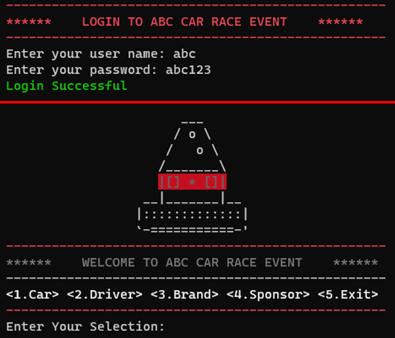

# Car Racing Event Management System

## Project Overview

The Car Racing Event Management System is a terminal-based application developed to manage a car racing event organized by ABC Pvt Ltd. The system handles the registration of cars, the recording of race results, and the determination of race winners. This project is aimed at demonstrating and understanding data structures.

  

## Features

- **Register Car Details**: Add new car details including unique number, brand, sponsor, and driver information.
- **Delete a Car**: Remove a car from the system.
- **Insert 3 Rounds Results**: Input the results for each of the 3 rounds of the race.
- **Find Out the Winners**: Determine the 1st, 2nd, and 3rd place winners based on the results.
- **Search for a Particular Car**: Look up specific car details.

###

  

## Technologies Used

- **Language**: Java
- **Development Environment**: VS Code
- **Execution**: Terminal

## Getting Started

1. Clone the repository: `git clone https://github.com/Nava-stack/abc-car-racing-java.git`
2. Open the project in VS Code.
3. Compile the Java files using `javac *.java`.
4. Run the application using `java MainClass`, replacing `MainClass` with the name of your main class.

## License

This project is licensed under the MIT License - see the [LICENSE](LICENSE) file for details.
